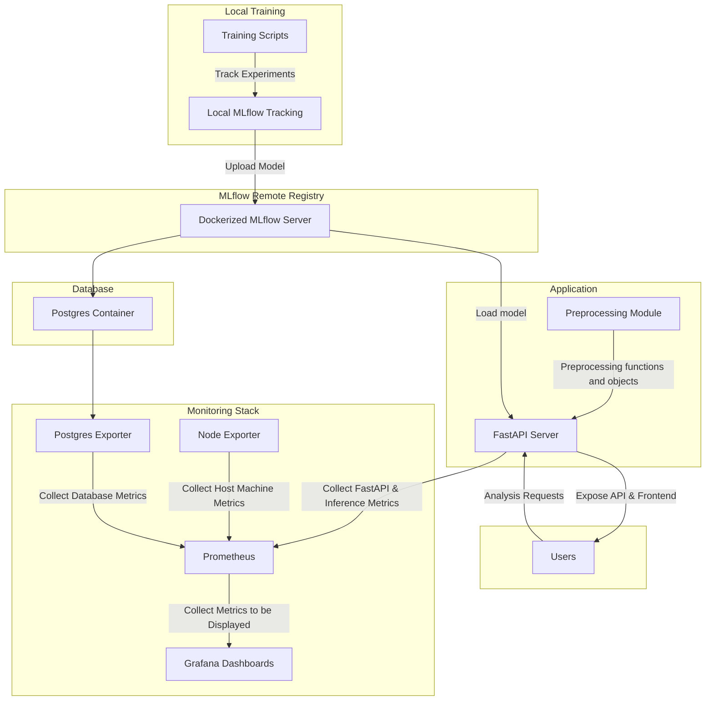

<p align="center" style="margin-bottom: 0px !important;">
  
</p>
<h1 align="center" style="margin-top: 0px;"><a style="color: white; text-decoration: none;" href="https://opinionlens.abdelazizwf.dev">OpinionLens</a></h1>

A production-ready sentiment analysis project leveraging local ML training with tracked experiments, DVC data versioning and pipelines, remote MLflow model registry, Dockerized services, and Prometheus/Grafana monitoring with inference instrumentation.

## Description

This repository serves two distinct goals, the training and hyper-parameter tuning of sentiment analysis models, and running the application and API that serve those models.
The training is done locally, and makes use of several MLOps tools, such as [MLflow](https://mlflow.org/docs/latest/) for experiment tracking, [DVC](https://dvc.org/) for data versioning and running data pipelines to cache preprocessed data, and [Optuna](https://optuna.readthedocs.io/en/stable/index.html) for hyper-parameter tuning.
The application is a [FastAPI](https://fastapi.tiangolo.com/) server with a minimal frontend and API endpoints for inference and model management. The application also uses a remote MLflow model registry to manage and version models that were trained locally.

There are two modes of deployment. Local deployment, which runs the FastAPI server and the remote MLflow registry locally (in which case the "remote" MLflow registry is the same local MLflow server used for training).
The other is [Docker](https://www.docker.com/) deployment using `docker compose`, which runs the application and the remote MLflow registry as separate containers. Docker deployment also contains a [PostgreSQL](https://www.postgresql.org/) container for any services requiring a database connection, a [Traefik](https://traefik.io/traefik) reverse proxy instance to regulate access to available services, and a fully featured monitoring stack with [Prometheus](https://prometheus.io/) and [Grafana](https://grafana.com/) alongside various monitoring instrumentations, including for the FastAPI server and for inference operations. The goal of the Docker deployment is to make the application production-ready and easy to deploy on a VPS or a remote server (**This doesn't include security and authentication, which are extremely important for real-world deployment**).

## System Diagram



## Usage

This section is divided into four sub-sections, the first is for setting up the project, the second is for training models on your local machine, the third is for local deployment, and the fourth is for Docker deployment.

> **Important**: The following steps assume a Unix environment (e.g. Linux or MacOS).

> **Important**: Deployment requires a model to be logged in the local MLflow server. Currently, only models that were hyper-parameter tuned are logged at the end of their runs, which means you have to run hyper-parameter tuning at least once to deploy the application.

### Setup

1. [Install uv](https://docs.astral.sh/uv/getting-started/installation/): the python environment management tool. This tool is used to develop this project and provides a lot of convenient functionality.
2. Clone the repository using Git.

    ```bash
    git clone https://github.com/abdelazizwf/OpinionLens && cd OpinionLens
    ```

3. Initialize the python environment and download all dependencies.

    ```bash
    uv sync
    ```

4. Download and unpack the required datasets. Check the [data section](#data) for more information.
5. Rename `env` to `.env`, `env.stage` to `.env.stage`, and `env.build` to `.env.build`. Check the [environment variables section](#environment-variables) for more information.

### Training

1. [Install DVC](https://doc.dvc.org/install)
2. Open a new terminal in the project directory to run MLflow, and leave it running. The MLflow server will be available at <http://localhost:5000>, and runs will be recorded under the experiment name set in `.../settings.py`, which is currently `imdb_amazon_airtweets_data`.

    ```bash
    uv run mlflow ui --host 0.0.0.0 --port 5000 --backend-store-uri sqlite:///mlruns.db
    ```

3. There are two types of training, a single run, and multiple runs for hyper-parameter tuning of one model. Check the [training types section](#training-types) for more information.
   - To perform a single run with scikit-learn models:

        ```bash
        dvc repro run_sklearn
        ```

   - To perform hyper-parameter tuning with scikit-learn models:

        ```bash
        dvc repro tune_sklearn
        ```

4. Once the training is done, you can head to the MLflow server to view the results.
5. Training settings are loaded from the file `params.yaml`. Feel free to adjust them and re-train.

### Local Deployment

1. Open a new terminal in the project directory to run the FastAPI server, and leave it running. The app will be available at <http://localhost:8000>.

    ```bash
    uv run fastapi dev src/opinionlens/app/main.py
    ```

2. Grab the model ID of the model you want the app to use.
   - Head to the local MLflow server, navigate to the current experiment, and choose the top-level hyper-parameter tuning run.
   - At the bottom there's a logged models section with a single entry, click on the model name.
   - On the side bar of the model page, the model ID is displayed (it should start with `m-`). Copy the ID.
3. Register the chosen model at the remote MLflow registry (which is the same MLflow server used for training because we're deploying locally). Replace `<model_id>` with the copied model ID, and replace `<model_name>` with an appropriate name for the model. When prompted for a password, just press Enter.

    ```bash
    uv run register_model <model_id> <model_name>
    ```

4. Visit <http://localhost:8000/admin>, this is a simple admin dashboard to manage models. There's a table of models that are loaded into the application (should be empty), and another for models available in the registry. The name of the recently registered model should be displayed. Go to the model fetching form, select the model name and model version (should be 1), check the set as active checkbox, and click fetch. After the model is loaded, the page should refresh with the updated information.
5. Head to the Home page (<http://localhost:8000>) and try the model by entering text in the textbox and pressing Evaluate. The result should appear underneath the button as either 'POSITIVE' or 'NEGATIVE'.
6. You can also try the API endpoints listed underneath using an API testing tool like [Postman](https://www.postman.com/) or [curl](https://curl.se/) or other alternatives. Be sure to add the top-level domain before the endpoint path (<http://localhost:8000>).

### Docker Deployment

1. Run the following command to make sure `docker compose` is installed correctly:

    ```bash
    docker compose version
    ```

2. Create a docker network to link all the services with each other.

    ```bash
    docker network create docker-net
    ```

3. Launch the local compose file to run all the services.

    ```bash
    docker compose -f compose.local.yaml up --build
    ```

4. Wait for all the services to complete initialization. The application will be operational when the following message appear at the end of the logs:

    ```txt
    opinionlens         | INFO:     Waiting for application startup.
    opinionlens         | INFO:     Application startup complete.
    opinionlens         | INFO:     Uvicorn running on http://0.0.0.0:80 (Press CTRL+C to quit)
    ```

5. Open the `/.env` file and change the `ENV` value to `stage` (i.e. `ENV="stage"`).
6. From here, all interaction with the application are similar to the [Local Deployment](#local-deployment) section (starting from step 2). Make sure to replace <http://localhost:8000> with the current URL <http://opinionlens.localhost>.
7. You can access other services as well to monitor the application or try any modifications:
   - The remote MLflow registry is located at <http://mlflow.localhost>
   - The Grafana dashboards page is located at <http://grafana.localhost/dashboards>
   - The Prometheus engine is located at <http://prometheus.localhost>

## Concepts

### Workflow

The workflow of this project assumes the user is a machine learning developer that wants to experiment with non-LLM sentiment analysis models.

Data is preprocessed separately using scripts that call on preprocessing functions and save stateful preprocessing objects (like vectorizers). This is done to ensure the same functions and objects are available for the application at inference time. The top-level `src/opinionlens/preprocessing/` directory contain such functions, split into their categories as modules. The `src/opinionlens/preprocessing/scripts/` contain the scripts run on the training data. The resulting data is saved on disk and version-controlled using DVC to minimize repetitions.

The training is done using individual scripts as well, each script loads the data it needs from disk and starts training. The scripts should be run as part of a DVC pipeline to ensure the data they need exists, or otherwise bring them from the cache or generate them.

When deploying the application, models have to programmatically registered with the remote MLflow registry, MLflow doesn't provide any other way. The application has to download models from the registry and load them in memory (instead or relying on the registry) for multiple reasons. The top reason is to minimize inference latency and maximize performance. The second is to make sure only the models required by the app are loaded, while the remote registry could be used to manage previous versions of models, or even manage models for other applications. This design decouples the application from the registry. The registered models can be managed via the MLflow server website.

### Data

The following datasets were used to train models during development. While only one of them is required, more data mostly equals better models. If you don't want to use a certain dataset, open `src/opinionlens/preprocessing/scripts/preprocess_data.py`, scroll to the function `main()` and you'll find a bunch of function calls, each with the name of the data they load and preprocess. Remove or comment out any function call that you don't want to use and save the file. This way, those datasets will not be needed.

- [IMDB Review Dataset](https://www.kaggle.com/datasets/lakshmi25npathi/imdb-dataset-of-50k-movie-reviews): Download and unpack at `data/raw/IMDB Dataset/`.
- [Amazon Food Reviews Dataset](https://www.kaggle.com/datasets/snap/amazon-fine-food-reviews): Download and unpack at `data/raw/Amazon Food Reviews/`.
- [Airline Tweets Sentiment](https://www.kaggle.com/datasets/crowdflower/twitter-airline-sentiment): Download and unpack at `data/raw/Airline Tweets/`.

### Environment Variables

Most services in the docker compose file require environment variables to build and configure correctly, those variables are located in `.env.build` and are used exclusively for docker.

Other variables are used for the application. The entire project uses `pydantic-settings` to manage the global configurations it needs. These settings are located at `src/opinionlens/common/settings.py`, and have the values required for local deployment by default. Those settings can be overridden at run-time using environment variables, which is the reason for the two other environment variable files. `.env` is used for non-application variables, and to set the application environment, while `.env.stage` is used to override settings when the docker deployment is used, to interact with the docker services. If you want to override any setting, checkout the instruction at the `.../settings.py` file, and add the variables to `.env`. Note that `.env` is always loaded by the application, while `.env.stage` is only loaded when `ENV="stage"` to override some settings to point to docker services.

All environment variable files are given with sensible defaults, so it's safe to leave them as is.

### Training Types

The two main training modes are single runs, where a model is imported and its parameter are set by hand, and hyper-parameter tuning. Hyper-parameter tuning uses Optuna to optimize parameter, and it depends on so-called subjects, which are configuration classes to simplify swapping models and their required parameter search spaces into the main tuning script. For sklearn, those are located at `src/opinionlens/training/sklearn_subjects.py`.

Single runs are intended for testing or validation of parameters. That's why only tuned models are logged to MLflow to be registered to the remote registry, they're supposed be the better models.

Each type is run from its own script, and their parameters and metrics are tracked with the local MLflow server, including some visualizations in the artifacts section. There are also scripts for running and recording baselines, and for running and recording evaluation on tuned models using custom datasets.

All scripts are run with DVC to ensure data consistency:

- To start a single training run: `dvc repro train_sklearn`
- To start hyper-parameter tuning: `dvc repro tune_sklearn`
- To run baseline tests: `dvc repro run_baselines`
- To run evaluations on the latest tuned model: `dvc repro run_evals`

### Monitoring and Instrumentation

When deploying with docker, a monitoring stack that includes Prometheus and Grafana is started to monitor various parts of the system. Prometheus relies on some exporters to pull metrics from certain systems, including Node exporter to monitor the host machine, Postgres exporter to monitor the database, and metrics endpoints provided by Traefik and FastAPI. There's also a metric endpoint for inference metrics. Grafana displays all those metrics in dedicated dashboards, which is extremely useful for real-world deployment.

All instrumentations and dashboard used were imported from external sources to make the most out of their functionality. The only exception is the inference metrics and the inference dashboard, which were handmade using the Prometheus python client to record metrics, and the Grafana dashboard builder to build the dashboard panels.

### Real-World Deployment

This project is made with real-world deployment in mind (it's already live at <https://opinionlens.abdelazizwf.dev>). However, it doesn't have security and authentication, which are required for real-world deployment. To secure the project, Traefik must be setup to work with `https` using TLS certificates, which you can get for free from [Let's Encrypt](https://letsencrypt.org/). Traefik also provides basic authentication for username/password log in, but a better option is a dedicated authentication and SSO service like [Authelia](https://www.authelia.com/) that acts as a forward-auth server for Traefik. If that's not feasible, many of the services used here have their built-in authentication. However, you'd have to manage how to authenticate other services trying to reach them from the internal network (e.g. Grafana connecting to Prometheus to pull metrics).
