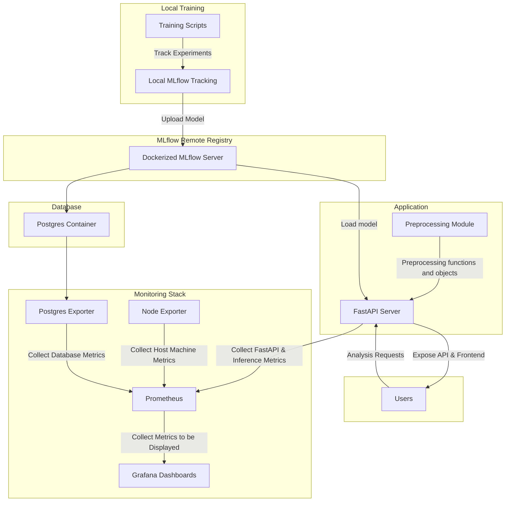

  

<h1 align="center" style="margin-top: 0px;">OpinionLens</h1>

A production-ready sentiment analysis pipeline leveraging local ML training with tracked experiments, DVC data versioning and pipelines, remote MLflow model registry, Dockerized services, and Prometheus/Grafana monitoring.

## Description

This repository serves two distinct goals, the training and hyper-parameter tuning of sentiment analysis models, and running the application and API that serve those models.
The training is done locally, and makes use of several MLOps tools, such as [MLflow](https://mlflow.org/docs/latest/) for experiment tracking, [DVC](https://dvc.org/) for data versioning and running data pipelines to cache preprocessed data, and [Optuna](https://optuna.readthedocs.io/en/stable/index.html) for hyper-parameter tuning.
The application is a [FastAPI](https://fastapi.tiangolo.com/) server with a minimal frontend and API endpoints for inference and model management. The application also uses a remote MLflow model registry to manage and version models that were trained locally.

There are two modes of deployment. Local deployment, which runs the FastAPI server and the remote MLflow registry locally (in which case the "remote" MLflow registry is the same local MLflow server used for training).
The other is [Docker](https://www.docker.com/) deployment using `docker compose`, which runs the application and the remote MLflow registry as seperate containers. Docker deployment also containes a [PostgreSQL](https://www.postgresql.org/) container for any services requiring a database connection, a [Traefik](https://traefik.io/traefik) reverse proxy instance to regulate access to available services, and a fully featured monitoring stack with [Prometheus](https://prometheus.io/) and [Grafana](https://grafana.com/) alongside various monitoring instrumentations, including for the FastAPI server and for inference operations. The goal of the Docker deployment is to make the application production-ready and easy to deploy on a VPS or a remote server (**This doesn't include security and authentication, which are extremely important for real-world deployment**).

## System Diagram

## Extra Information

### Data

- [IMDB Review Dataset](https://www.kaggle.com/datasets/lakshmi25npathi/imdb-dataset-of-50k-movie-reviews): Download and unpack at `/data/raw/IMDB Dataset/`.
- [Amazon Food Reviews Dataset](https://www.kaggle.com/datasets/snap/amazon-fine-food-reviews): Download and unpack at `/data/raw/Amazon Food Reviews/`.
- [Airline Tweets Sentiment](https://www.kaggle.com/datasets/crowdflower/twitter-airline-sentiment): Download and unpack at `/data/raw/Airline Tweets/`.
