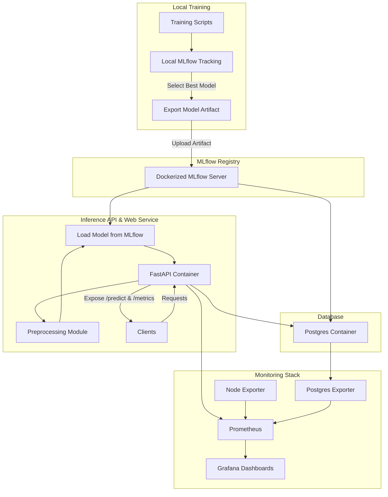

# OpinionLens

A production-ready sentiment analysis pipeline leveraging local ML training, DVC data versioning, MLflow model registry, Dockerized services, and Prometheus/Grafana monitoring.

## Planned Features

- [X] Monitoring stack with Prometheus and Grafana
- [ ] Reverse proxy configuration with Traefik
- [ ] Training and deploying deep models
- [ ] Model interpretability
- [ ] More raw data and using sampling techniques for training data
- [ ] Extensive testing

## System Diagram

## Extra Information

### Data

- [IMDB Review Dataset](https://www.kaggle.com/datasets/lakshmi25npathi/imdb-dataset-of-50k-movie-reviews): Download and unpack at `./data/raw/`.
